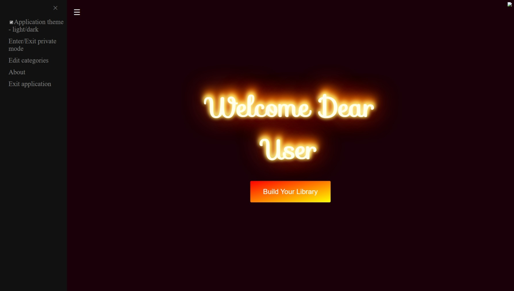

# sela-album-hub-finale

#### Sela album hub is an image management app. Sela album hub is a magnificent solution for customers who love to store photos. No more mess with your local photos on your computer. This app has single source of all your photos.  Sela album hub support adding new images from local-device, from online search, and even from your local device camera!

- The app was made with __angular__ as frontend framwork and __nod.js__ for the server. 
- API'S
    - [pexels api](https://www.pexels.com/api/) provide large photos stock.
    - [google maps api](https://cloud.google.com/maps-platform) allows to pin and save a location for photos.
- All users and photos data save into __json__ files.

## App formation

users welcome page. users can change the theme color to dark mode in the menu in the top left corner of the page.

welcome page             |  another theme
:-------------------------:|:-------------------------:
  |  