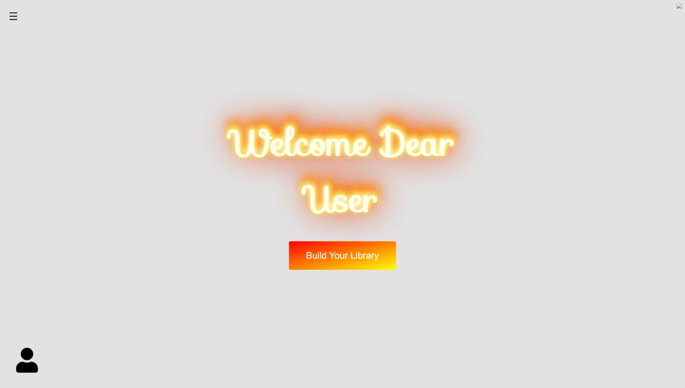

# sela-album-hub-finale

#### Sela album hub is an image management app. Sela album hub is a magnificent solution for customers who love to store photos. No more mess with your local photos on your computer. This app has single source of all your photos.  Sela album hub support adding new images from local-device, from online search, and even from your local device camera!

- The app was made with __angular__ as frontend framwork and __nod.js__ for the server. 
- API'S
    - [pexels api](https://www.pexels.com/api/) provide large photos stock.
    - [google maps api](https://cloud.google.com/maps-platform) allows to pin and save a location for photos.
- All users and photos data save into __json__ files.

## App formation

users welcome page. users can change the theme color to dark mode in the menu in the top left corner of the page.

welcome page             |  dark theme
:-------------------------:|:-------------------------:
  |  

option and detail pages allow you to customize your app settings like library name, camera usage and more.

option page             |  detail theme
:-------------------------:|:-------------------------:
  |  

now the user can add images to his album. 
the user can capture a picture using local camera device:

local device folders:

or import photos online with specific topics search:

the gallery page allow you to see all your photos in the album.
each photo reveal its information and details.
user can filter his photos and search & show them by name/categoty.

user can search only favorites photos.
user can enter/exit private mode. photos defined as private will appear only when user enters private mode.
user need to type in the password he registered with in option page.

user can display his photos in slide show 

